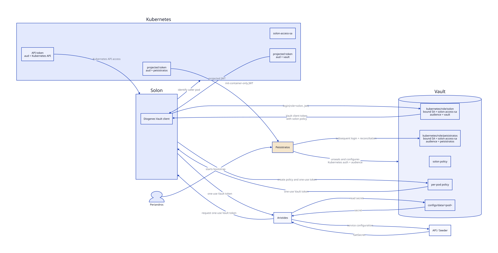

# Solon documentation

## Vault authentication and secret retrieval



The flow contains two different kinds of tokens:

1. Kubernetes authenticates Solon to Vault with a short-lived, projected
   ServiceAccount JWT. Its audience must match the `audience` configured on
   Vault's `auth/kubernetes/role/solon` role.
2. Once authenticated, Solon creates narrowly scoped, one-use Vault tokens for
   Aristides. Aristides uses one of these Vault tokens to read the calling
   workload's secret. These are Vault tokens, not Kubernetes ServiceAccount
   tokens, and therefore have no Kubernetes JWT audience.

Solon also needs its regular Kubernetes API token to identify caller pods and
watch Kubernetes resources. A Vault-specific projected token must therefore be
mounted at a separate path instead of replacing the standard Kubernetes API
token.

Peisistratos receives a second projected token with the `peisistratos`
audience. It is mounted only into the init container and authenticates against
the dedicated `peisistratos` Vault role when reconciling an existing Vault.
Keeping the audiences distinct prevents Solon's `aud=vault` token from being
accepted by the more privileged reconciliation role, even though both
containers use `solon-access-sa`.

The diagram source is [`vault-auth-flow.d2`](vault-auth-flow.d2). Regenerate the
SVG with:

```shell
d2 solon/docs/vault-auth-flow.d2 solon/docs/vault-auth-flow.svg
```
